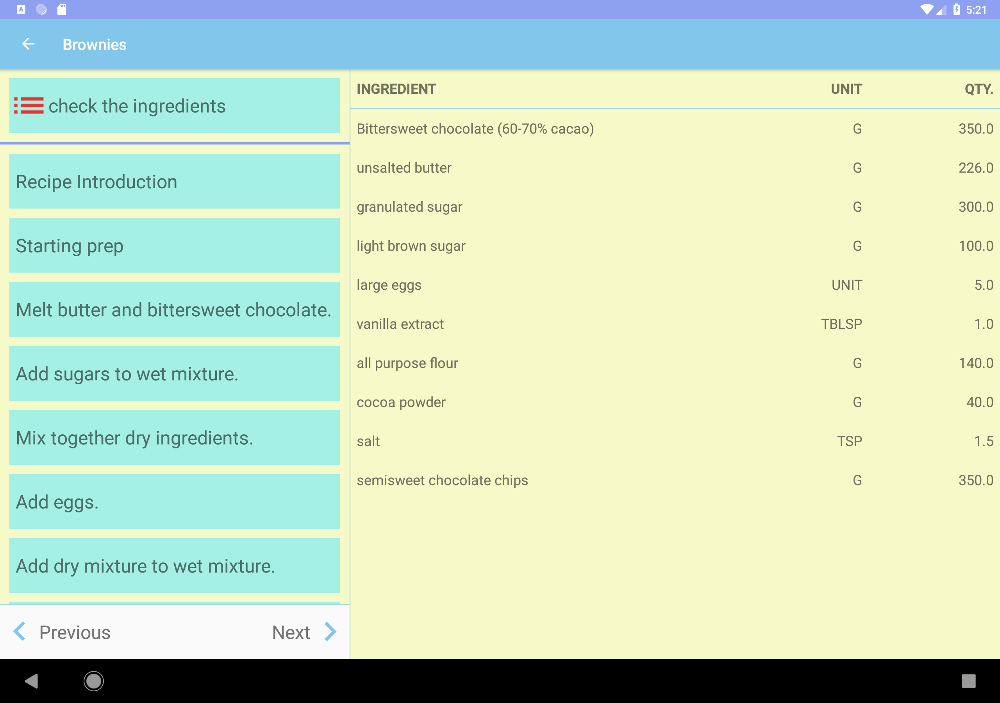

# Bake Master
A app which guides you step by step towards making delicious desserts.

# Description
This app is part of the Udacity Android Developer Nanodegree program.

Bake Master allows Udacity’s resident baker-in-chief, Miriam, to share her recipes with the world. It allows a user to select a recipe and see video-guided steps for how to complete it.

The application uses as data source a JSON file which it fetches from the internet.

UI uses Master Detail Flow to display recipe steps and navigation between them, ExoPlayer to display videos and has a widget which displays the ingredient list of a desired recipe.

As third-party libraries it uses Retrofit to make the network requests and Picasso to display the different images.

It uses the new Android Jetpack Components: Lifecycles, LiveData, Room and ViewModel.

Application makes use of Espresso to test aspects of the UI.

# Screenshots
Phone

  

 

Tablet

 

 